# 公共交通可达性水平PTAL应用前瞻 #

## 一、引言

公共交通引导城市发展（TOD）的规划理念自2000年左右开始随着国内城市轨道交通建设提速而进入公众视野。但长期以来，TOD理念在国内缺乏配套的制度支持和工具支撑，常用的站点覆盖率、线网密度指标不足以为公交系统改善提供科学有效的调节依据。国内城市发展迫切需要更加先进的工具为公共交通设施建设及相关规划、决策、评估过程提供支持。
公共交通可达性水平（PTAL）作为TOD理念指引下的量化分析工具，在世界范围内获得了广泛研究和应用，其在用地和设施投放、区域中心等级评估、交通管理政策以及区域公交改善方案制定等多方面有着成功的落地经验。相对同类型的其他评估方法，PTAL具备评估体系更综合、数据需求更少、可视化效果更突出的优势。对我国城镇化进程迈入下半场，从高速度向高质量转变的关键时期，PTAL有着巨大的实用价值。
本文从数据需求、计算流程、敏感性、应用场景等多个维度对PTAL进行了剖析。并以深圳和武汉PTAL计算为例，重点分析了PTAL在公交改善、共享单车接驳评估方面的实用价值。提出通过打造一站式的PTAL评估分析工具，降低规划决策成本，助力城市发展提质增效的愿景。

## 二、背景

公共交通可达性水平PTAL（Public Transport Access Level）于1992年由伦敦Hammersmith and Fulham地区率先引入，并在2001年扩展到了整个伦敦市，作为大伦敦地区评估公共交通可达性水平的标准方法。目前，该方法已推广到了荷兰、澳大利亚、新西兰、印度和新加坡等国家。国内部分城市，如北京、上海、天津、武汉也在积极探索使用PTAL作为控规编制过程中的参照指标。
PTAL能够评估城市中任一地点获取公共交通服务的便利程度，它一方面反映了评估点所在区域的公共交通线网密度，另一方面也将线网的服务能力，如发班间隔、线路的可靠性等纳入了考量范围。一个具有高公共交通可达性水平的地点一般满足以下一个或多个条件：

- 距离公共交通站点的步行距离很短；
- 对应站点的等车时间很短；
- 有多条线路经过邻近站点；

在伦敦交通局（TfL）发布的《交通评估最佳实践指导手册》中，PTAL一共分为从0到6六个等级，等级越高表示可达性越好。其中等级1和等级6被进一步细分为1a、1b和6a、6b。结合TfL发布的分级设色标准，通过类似热力图的方式，可以清晰地展现一个地区的公共交通可达性水平。\
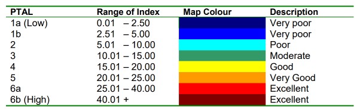\
图 1 TfL规定的PTAL分类标准\
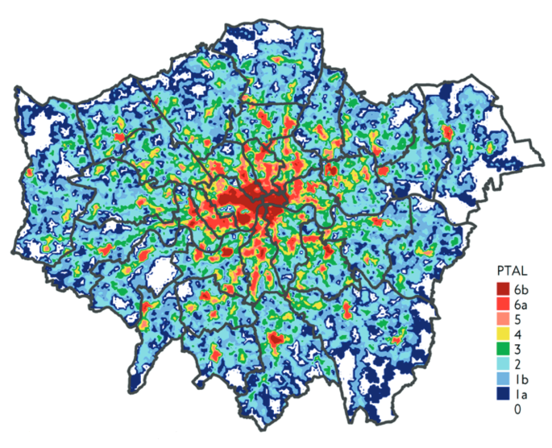\
图 2 大伦敦地区PTAL示意图\
（来源：Assessing Transport Connectivity in London）\
此外，伦敦交通局专门为开发了网页端的“可达性评估工具箱”——WebCAT，基于PTAL向公众开放面向公共交通可达性评估的定制化快速查询体验，该工具支持基于地址搜索以及现状年和规划年的比较查询。在为城市规划决策服务的同时，也为普通民众的居住选址、公交出行评估提供了开放、专业的途径。WebCAT有效降低了公共交通评估决策的成本，通过简洁清晰的可视化方式向规划管理部门提供专业评估结果，是业务领域内的一大创新。\
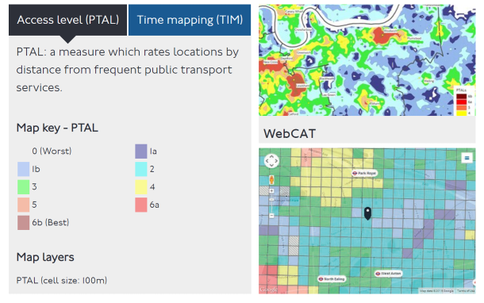\
图 3 伦敦交通局开发的网页端“可达性评估工具箱”——WebCAT\

## 三、PTAL计算

TfL规定的PTAL评估时段主要在工作日的早高峰期，以测算可达性能够覆盖的最大范围及程度。伦敦地区采用08:15至09:15之间的数据进行评估。
计算PTAL需要准备4类信息：
1、期望评估PTAL值的全部地点位置：面向城市级别的评估，通常采用网格的形式对整个地区的公共交通可达性进行采样和测算；
2、对应地区全部公交、轨道站点信息，也称为公交服务获取点SAPs：Service Access Points；
3、该地区的步行网络，即所有可供行人步行使用的道路（包括非市政道路），用于计算从期望起始点到公交服务获取点（SAPs）的时间；
4、与上述公交服务获取点（SAPs）相对应的全部共公交、地铁线路，以及相应的发车频率。
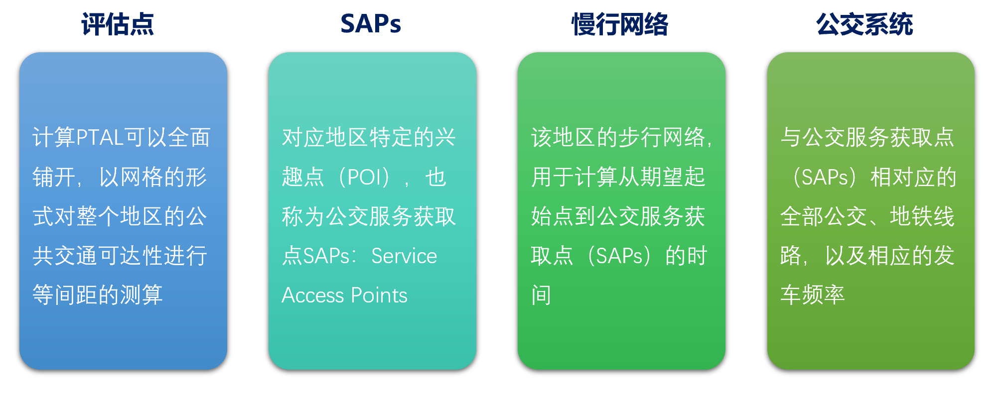\
图 4 面向PTAL评估的数据需求\
计算流程如下：
1、确定全部的评估点。评估点可以是特定的兴趣点（POI），如学校、办公楼等，也可以是某些用地类型的地块（中心）。结合步行网络计算评估点到附近公交/轨道站点的步行时间。分别以640m（公交）和960m（轨道）为阈值，结合公交、轨道站点线路信息，获取评估点到线路的最短步行时间。
2、计算全部线路的计划等车时间SWT(Scheduled Waiting Time)和平均等车时间AWT(Average Waiting Time)，其中计划等车时间为发班间隔的1/2，平均等车时间在计划等车时间的基础上，按对应交通方式增加了可靠性（惩罚）因子RF（Reliability Factor）。在TfL手册中，普通公交的RF值为2分钟，轨道的RF值为0.75分钟。
3、在2的基础上计算总接驳时间TAT（Total Waiting Time），即步行时间加上平均等车时间。
4、计算等效服务频率EDF（Equivalent Doorstep Frequency），即将总接驳时间视为计划等车时间的前提下，对应线路的车辆发班间隔。
5、对于每个评估点，分别计算城市轨道和公交对于该点的可达指数AI（Access Index），AI的值等于在该评估点对应全部可达线路的EDF值中，最大的EDF值与0.5倍其他线路EDF值的总和。
6、将不同方式的AI值加总，得到最终的PTAL值。
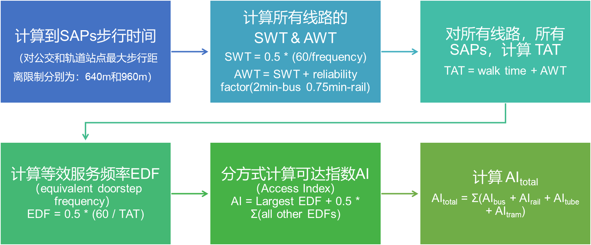\
图 5 PTAL计算流程\
不同城市计算PTAL的模型参数应当本地化，本文使用的参数参考了高德导航步行速度（70.2米/分钟），而最大步行距离仍按照TfL手册中规定的接驳半径进行约束。

| **参数**     | **单位**  | **采用值** |
| ------------ | --------- | ---------- |
| 步行速度     | 千米/小时 | 4.212      |
| 步行速度     | 米/分钟   | 70.2       |
|              |           |            |
| **公交**     |           |            |
| 可靠性因子   | 分钟      | 2          |
| 最大步行距离 | 米        | 640        |
|              |           |            |
| **轨道**     |           |            |
| 可靠性因子   | 分钟      | 0.75       |
| 最大步行距离 | 米        | 960        |

图 6 用于PTAL计算的模型参数\
**PTAL的核心优势**
相比其他类型的公共交通可达性评估方法，PTAL有两大核心优势：
一、数据需求少：国内城市可以充分结合开放的轨道、公交站点线路数据资源，辅以少量的公共交通本地营运参数即可完成评估，同时计算流程便捷，容易推广。
二、应用门槛低：不同于基于交通模型的用地、可达性评估，PTAL的可视化简洁明晰，便于掌握与应用，**尤其适合非交通专业领域的规划决策者。**

## 四、PTAL敏感性分析

通过单条轨道/公交线路在不同服务水平和步行接驳距离条件下计算AI值容易得到，影响PTAL值最主要的因素是步行距离，其次是发班间隔。轨道线路由于计划等车时间和可靠性因子均较低，因而相对有更高的AI值，但单条轨道对邻近地区AI的贡献值很难超过15，即达到Level 4（良好）的水平。相对轨道交通，公交服务的PTAL值对于步行距离的敏感性更低，主要原因是公交总体的发班间隔较长。以发班间隔15min的公交线路为例，当步行距离从100m增加到640m时，PTAI值从2.79衰减到1.71，仅降低了38.7%。
图 7 不同发班间隔下步行距离对轨道和公交PTAI值的影响
此外，在平均发车间隔为3min的条件下，单个轨道站点对步行距离超过400m以上区域的PTAI贡献值一般在5以内，而国内平均站间距基本在超过1km以上。通过构建一个三站点特殊场景来考察一个区域在多条轨道覆盖情况下PTAI值的叠加结果，如图6所示，在上述场景下，当评估点远离任一站点中心200m以上时，对应的PTAI叠加值会迅速下降至10以内。
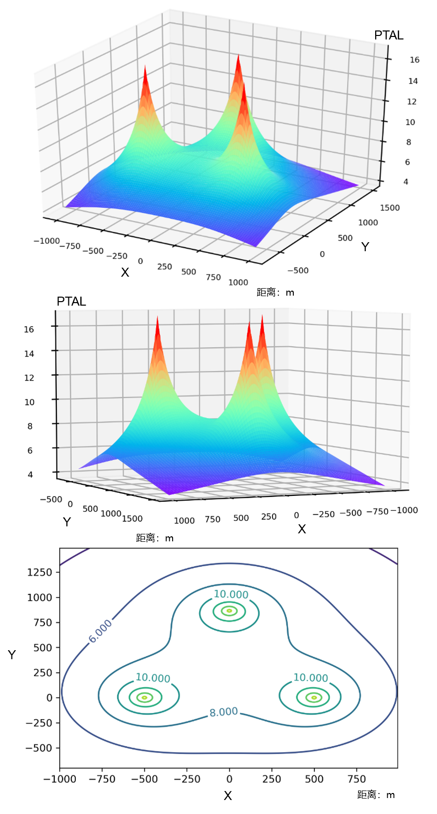\
图 8 一个典型的三角排布轨道站点PTAI值叠加分析\
综合轨道和常规公交在对周边区域PTAI的影响规律，城市轨道交通对于提升PTAL覆盖范围有重要作用。但由于国内绝大多数城市地铁线网仍处于快速发展时期，线网密度与国外大城市如纽约、伦敦、巴黎等还有一定差距，**单纯依赖地铁仅能实现PTALs达到3级（普通）水平。因此必须结合常规公交相对低成本的线网搭建和高密度的站点布设，与城市轨道交通充分衔接，才能驱动区域PTALs到5级（优良: Very Good）以上。**

## 五、PTAL应用-以深圳和武汉为例

**深圳**
深圳基于TransPaaS平台开发了100m栅格精度的PTAL评估工具，结合全市1.3万个公共交通站点，2000余条轨道公交线路及超过1200万条（1个月）的公交运营到站记录数据，使用高德接口进行了超过100万次路径规划采样，按照本地化的PTAL参数进行计算。最终成果采用栅格和交通小区（TAZ）的形式进行了可视化。\
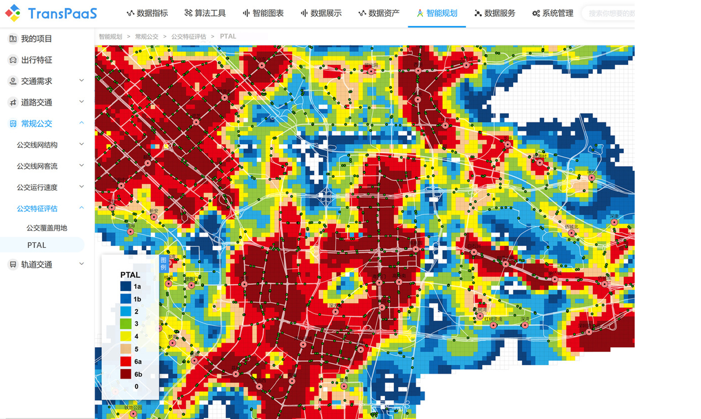\
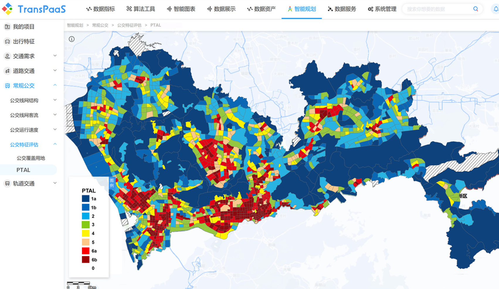\
图 9 基于TransPaaS的PTAL评估结果：100m网格（上）和交通小区（下）\
结合深圳人口分布情况和圈层划分，对各圈层内不同PTAL等级交通小区覆盖人口比例进行统计。现状深圳二圈层（龙华、宝安、龙岗等）居住大量人口，其中部分在一圈层工作，职住用地分布不合理、公共交通服务水平不足，导致“英雄难过梅林关”；近期深圳可加快轨道建设、优化与轨道接驳公交线路、开通点到点班车，远期应调整用地空间布局。\
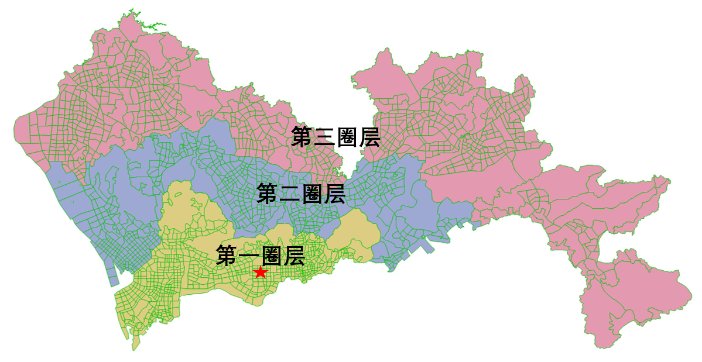\
图 10 深圳市圈层划分图\
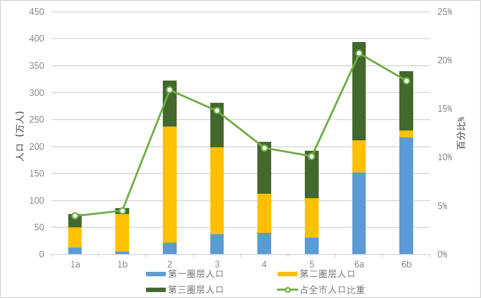\
图 11 深圳不同圈层PTAL与人口分布关系\

**武汉**
武汉PTAL采用200m的网格，对全市9条轨道，3条有轨电车和784条公交线路，总计约1.7万个站点进行处理，公交运营数据方面，以武汉公交、轨道时刻表数据为基础、公交GPS和到发站数据作为补充，对不同线路服务水平进行计算。以传统三镇为区分，汉口地区较武昌、汉阳公共交通可达性水平明显更优。主城（三环）范围内江汉区公交可达性水平最高，PTALs平均达到了23.78。
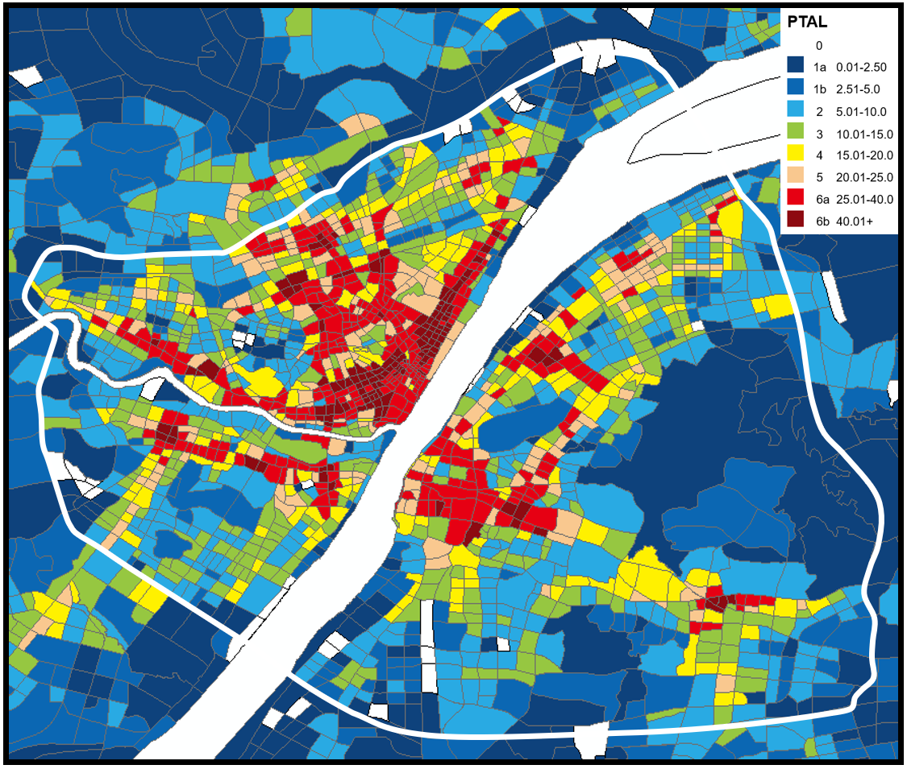\
图 12 武汉主城区PTAL计算结果\

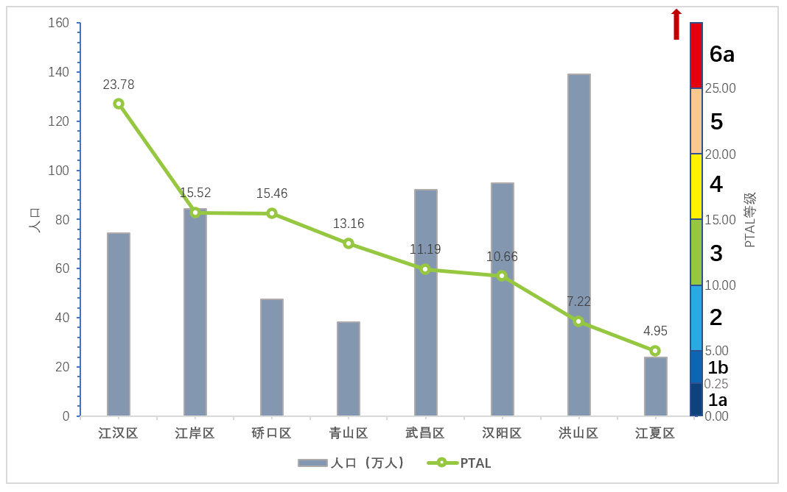\
图 13 武汉主城区各行政区PTAL均值和人口对比\
从边际效用最大化的角度看，优先改善高人口密度地区的公共交通可达性是最具吸引力的针对性提升措施。结合PTAL和区域人口统计数据，能够快速识别潜在高价值的改善区域。图13结合交通小区进行了PTAL平均值计算，并结合交通小区人口密度进行3D可视化。小区柱形高度代表区域的相对人口密度，通过筛选密度大于3万人/平方公里同时PTAL<10的区域，筛选得到近期改善目标地区。\
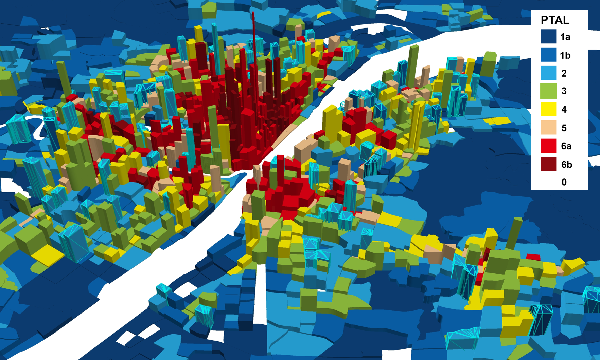\
图 14 交通小区PTAL-人口密度立体图（高度对应人口密度）\
**现状武汉市二环以内的核心城区，在武昌、青山以及硚口区仍然存在公共交通服务明显缺位的地带。**

## 六、自行车接驳对PTAL的影响

作为慢行交通方式的重要组成，将自行车接驳纳入PTAL评估具有重要的现实意义。伦敦目前已经提出采用自行车接驳等级（CYTAL）来鼓励面向城市外围PTAL等级为0到2的地区实施更具可持续性的高密度住宅开发。通过缩短前往站点的时间，自行车接驳能从两方面提升区域的公交可达性水平：1、通过缩短评估点到站点的时间，使得评估点PTAI提升；2、增大站点覆盖半径，使在步行条件下站点可达范围外的区域获得额外的可达性。
研究分别以深圳前海以武汉光谷地区为例，计算了在共享单车接驳条件下该区域PTAL的变化。在计算中，骑行速度被规定在12km/h，并将使用单车接驳距离控制在400m以上。同时，参考TfL中地铁接驳时间12min的限制，将共享单车的最大覆盖半径设置为2400m，并在首末端各增加了1分钟的取车/停车惩罚时间。得到两地PTAL和CYTAL见下图。
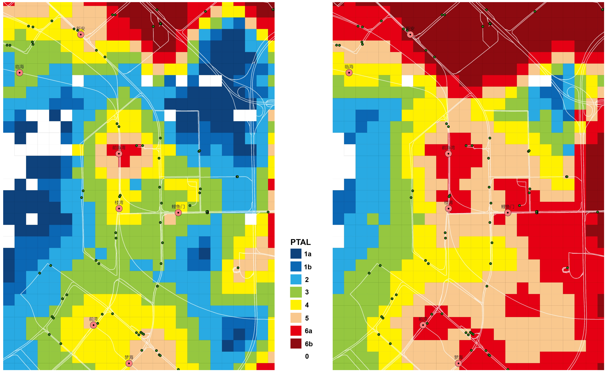\
图 15 前海地区PTAL(左)和CYTAL(右)对比\
**自行车接驳对前海地区公交可达性原1a，1b的地区起到了明显改善作用。**
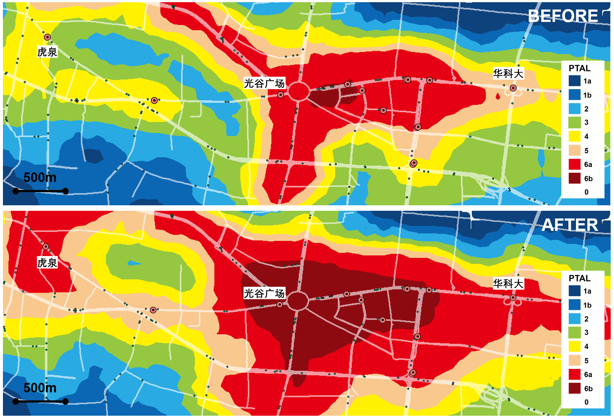\
图 16 光谷地区PTAL(上)和CYTAL(下)对比\
**考虑骑行接驳后，光谷核心区域等级为6a、6b的区域扩大了近一倍。对于到站点中长距离的区域，正常能够使PTAL提升1个等级。**
尽管上述计算过程仅为理想情况下，即人们能随时随地采用骑行方式且不考虑额外成本（如租赁共享单车的成本），仅以出行距离作为判断选择共享单车出行的条件时区域整体可达性变化情况。评估结果仍然展示了完善骑行环境和共享单车供应管理为公共交通可达性带来潜在提升空间。对于推广“最后一公里”绿色出行具有重要的实践价值。

## 七、PTAL的应用价值

**1、指导居住用地投放以及配套公共设施供给**\
PTAL已经深入到区域发展策略以及规划中。如在大伦敦规划中PTAL被作为增加住房供应，优化居住用地密度的核心指标，明确规定现状及规划居住用地PTALs应达到3-6，或在轨道站点或城镇中心区边界800m范围内。对应公共设施投放应当与PTALs适配，以满足大容量和密集使用的需求。\
**2、为停车配建和停车政策制定提供借鉴依据**\
基于区域的公共交通可达性和连通性严格限制停车配建、管控开发强度，在可达性高的地区降低配建指标，以鼓励公交出行。PTALs可以作为停车配建、停车收费等政策制定过程中的参照指标。在最新版的大伦敦规划中，PTALs与包括居住、零售、酒店餐饮及娱乐设施用地的停车配建指标绑定。其中对于PTALs达到5-6的区域，配建指标降为0，从而向Car Free的目标迈进。\
**3、评估区域人口、就业以及经济增长潜力**\
结合区域规划年人口、就业承载力及PTALs发展水平，科学评估地区增长潜力。遵循TOD的原则，城市优先发展高密度住宅和商业的地区首先应该具备良好的公共交通可达性。伦敦地区即根据PTALs来对城镇中心划分不同等级，其中主要市镇中心应达到5，大都会中心和国际中心应达到6a、6b，并规定了对应的开发强度区间。上述以公交可达性水平为导向的集约化开发模式，有助于高效利用土地和公共交通设施资源。\
**4、识别潜在的公共交通可达性重点改善区域，促进公平发展**\
公共交通设施效用最大化的核心在于以有限的资源向尽可能多的人提供优质服务。良好的公共交通服务能有效扩大工作半径，为低收入群体提供更多就业机会。结合PTALs和城市人口、岗位和收入分布，可以迅速识别公共交通服务缺位的地区以及其中的低收入区域，进行针对性改进，促进城市资源和机会均衡分配。\
**5、结合TransPaaS技术开放平台，打造城市PTALs开放查询分析工具集**\
根据PTALs分析工具，基于TransPaaS技术，建立覆盖主要城市的PTAL评估应用平台，并实现长期动态监测计算，向各规划行业和社会公众开放，为公众生活提供应用服务。通过智能规划平台云端构建标准化的城市级PTALs分析工具，接入互联网地图数据和城市规划数据，形成由规划行业主导和共同维护的国内城市PTALs开放查询分析服务。\

## 八、PTAL作为静态指标的局限性

PTAL将步行时间，可获得公共交通方式的数量、服务水平（发车间隔）、可靠性纳入评估范畴，是一种相对综合、灵活的静态指标，PTAL也有其自身的局限性，主要体现在：
1、PTAL无法评估从通过公共交通方式可覆盖的范围，也无法反映出行过程中不同方式和线路的速度、舒适性、换乘便利性等效用因素；
2、模型对步行接驳时间和等车、乘车时间以及可靠性惩罚因子设置了相同的权重，没有考虑出行者在各出行阶段不同的时间价值；
3、对出行者设定了相同的步行速度和出行意愿，缺乏对不同出行群体的差异化考量。
4、PTAL目前仅面向早高峰计算一天中可达性水平的最大值，有待进一步拓展到其他时段，满足全天候动态评估的需求。
PTAL在面向不同地区应用过程中，还有与本地公共交通发展及居民出行特性深度融合的定制化空间。在实际应用中，PTAL应与人口、岗位、用地及相关社会经济发展指标紧密结合，在分类精细化评估基础上支撑公共交通规划、运营、决策过程。

## 九、结语

我国目前仍然处于快速城镇化时期，无论对于未来大城市群，中心城市亦或是中小型城市，合理构建、评估、改善城市公共交通体系，打破城市规划和交通规划间的藩篱，落实公共交通引导城市发展的理念依然任重道远。国内不仅需要在技术层面上统一和发展公共交通服务水平评估标准体系，更应从法律规制层面对其应用和推广予以支持。同时应充分借鉴伦敦WebCAT打造“网页规划工具箱”的成熟经验，面向解决传统公交规划数据量化评估周期长、成本高、方案测试数量受限等一系列瓶颈，在不依靠精细化交通模型的条件下，打造一站式、低成本、高时效的PTAL评估分析工具，为公共交通运营方案评估改善、公交接驳提供技术支撑，并加快融入各专业规划决策中。

## 致谢

本文涉及的相关研究数据得到了武汉市交通发展战略研究院的大力支持，在成文过程中亦获得了研究室郑猛主任的宝贵建议；数据模型中心为深圳本地公交运营数据提供了最新计算分析结果，在此一并鸣谢。

## 参考文献

[1] TFL. Transport Assessment Best Practice Guidance Document [R]. Transport for London, 2010.
[2] TFL. Assessing Transport Connectivity in London [R]. Mayor of London, Transport for London, 2015.
[3] GLA. The London Plan 2019: Spatial Development Strategy for Greater London [R]. Greater London Authority, 2019.
[4] Inayathusein A, Cooper S. London's Accessibility Indicators: Strengths, Weaknesses, Challenges[C]. International Transport Forum Discussion Papers. OECD Publishing, 2018.

